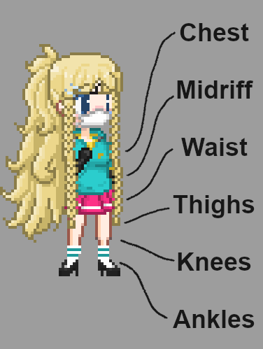

# Canvas model documentation

[[_TOC_]]

# Wiki

A reminder for the different states clothing can be in.

# Model options

## Clothes object

## Penetrator object

# To Do

## Clothes

Supported clothing from preliminary testing:

Upper:

-   gymshirt
-   top

Lower:

-   skirt

### Issues

-   [ ] Shirt sprites have sleeves embedded into them, these should be moved to the sleeves of the sprites.

## Penetrators

Penetrator(s) need to be redesigned to rest upon the face of the PC:

-   img\newsex\missionary\penetrators\human\mouth-entrance.png
-   img\newsex\missionary\penetrators\human\mouth-imminent.png

Penetrator(s) need to be improved so the base of the penetrator does not seem too intrusive for when other NPC shadows are over it.

-   img\newsex\missionary\penetrators\human\mouth-penetrated.png
