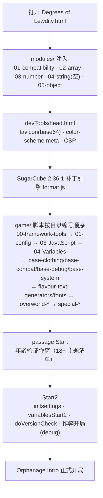
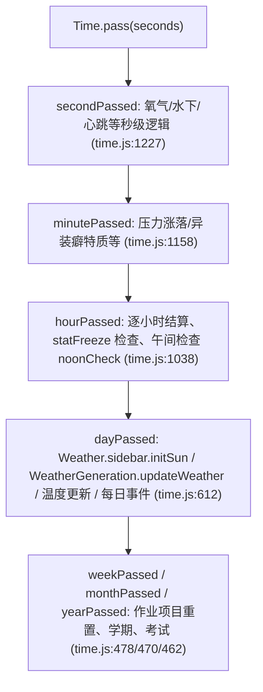
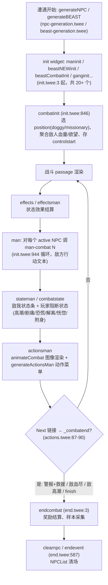
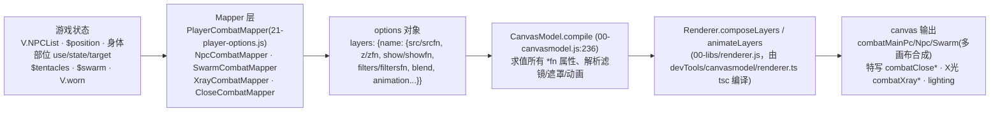

# Degrees of Lewdity 仓库深度扫描报告

> **仓库**: `github.com/0xnayuta/degrees-of-lewdity`（本地路径 `/root/repos/degrees-of-lewdity`）
> **调查快照**: 默认分支 `master` @ `41993d3f`（tag `0.5.11.9`），2026-08-07
> **调查方法**: 三阶段（快速概览 → 五线并行子系统深潜 → 交叉验证）；所有关键符号均经源码检索验证，证据以 `路径:符号` 或 `文件:行号` 标注；无法从源码直接确认的判断标 `[推断]`。
> **报告结构**: 按任务书八章组织，末尾附"速查表/README 与实际仓库差异清单"。

---

## 1. 项目概览 (Overview)

### 1.1 项目定位

**Degrees of Lewdity（DoL）** 是一款成人向（18+）开放世界文本 RPG：玩家扮演一名孤儿院少年/少女，在英国小镇中进行日常生存、上学、打工、社交与冒险。游戏以 **Twine/SugarCube 2** 为引擎，最终产物是**单个自包含 HTML 文件**（可离线游玩，也可经 Cordova 打包为 Android APK）。

本仓库 `0xnayuta/degrees-of-lewdity` 是原作者 Vrelnir 官方仓库（上游 GitLab: `gitgud.io/Vrelnir/degrees-of-lewdity`）在 GitHub 上的 **fork/镜像**。证据：

- `game/01-config/versionInfo.twee` 的 `<<linkinformation>>` widget 中，官方链接（vrelnir.com、blogspot、fanbox、Discord）均指向 Vrelnir 本人渠道；`sourceLinkEnabled: false` 时源码链接默认不显示。
- `game/01-config/start.twee` 的 StoryData 声明 `"format": "SugarCube"`，引擎即本仓库自带。
- master 分支提交历史全部为上游风格（`Merge branch 'bugfixes' into 'dev'`、`Updated to 0.5.11.9` 等），`git log` 前 25 条无一条本仓库独有功能提交——master 是上游镜像主线。

### 1.2 版本与维护状态

| 维度 | 事实 | 证据 |
|---|---|---|
| 当前版本 | `0.5.11.9`，命名版本 **"The Great Equaliser" edition** | `version` 文件、`game/01-config/sugarcubeConfig.js:14`（`StartConfig.version`）、git tag `0.5.11.9` 三处一致；`sugarcubeConfig.js:15`（`versionName`） |
| 发布节奏 | X.Y.0 为大版本（有命名，如 "Lofts of Clothes"、"Here Comes the Sun"），X.Y.Z 为补丁 | `DoL Changelog.txt`（19,841 行，新→旧排列；条目无日期） |
| 维护活跃度 | 持续迭代：0.5.11.0 → 0.5.11.9 连续 9 个补丁版本；提交以 bugfix/特性分支合并为主 | `git log`、`git tag` |
| 许可证 | **CC BY-NC-SA 4.0**（非商业、署名、相同方式共享） | `LICENSE:1` |
| CI/CD | **完全没有**：无 `.github/`、无 `.gitlab-ci.yml`、无任何 CI 配置文件 | 目录盘点（仅 `.gitlab/issue_templates/Default.md`，上游 GitLab 遗留的 issue 模板） |
| 自动化测试 | 无测试框架；质量保障靠静态脚本（见 §7） | `package.json`（scripts 仅 lint/lint-staged） |

### 1.3 分支策略

`git branch -a` / `.git/packed-refs` 可见：

| 分支 | 角色 | 依据 |
|---|---|---|
| `master` | 上游镜像主线（当前默认分支） | 提交历史全是上游合并；`origin/HEAD -> origin/master` |
| `dev` | 上游开发集成分支（镜像保留） | 提交中大量 `Merge branch 'xxx' into 'dev'` |
| `CombatImageRework` | **战斗图像重制**主题分支——canvasmodel 渲染器的开发来源 | 分支名 + 仓库内大量 canvasmodel 相关代码/文档（见 §5.3） |
| `morepassouts` / `separate-npc` / `weather-newspaper` | 功能主题分支（更多昏迷场景 / NPC 拆分 / 天气报纸） | 分支名 `[推断]`（分支内容未逐一 diff） |
| `myonmyuu/degrees-of-lewdity-3d` | 3D 实验分支（他人提交） | 分支名 `[推断]` |
| `revert-5f17e613` / `revert-6827d2d7` | GitHub 自动生成的 revert 分支 | 分支名惯例 |

---

## 2. 技术栈与架构 (Tech Stack & Architecture)

### 2.1 语言与依赖

- **Twee 标记**（SugarCube 2 语法）：游戏全部内容（passage、widget、宏）以 `.twee` 编写，位于 `game/` 下。
- **原生 JavaScript（ES2022）**：无框架、无构建期转译；`package.json` 的 devDependencies 只有工具链（eslint、stylelint、prettier、husky、lint-staged、typescript、`@types/twine-sugarcube`、`@types/jquery`）。
- **CSS**：位于 `modules/css/`（35 个文件：base.css、combat.css、combat-layers.css、canvasmodel.css、weather.css 等）+ `game/00-framework-tools/01-error/error.css`。
- **TypeScript**：仅两处——`devTools/canvasmodel/`（渲染器 TS 源码，`tsc` 编译）与 `devTools/bodywriting-sprite-generator/`；另有 `types/` 下 **15 个 `.d.ts`** 为游戏 JS 提供类型（`jsconfig.json` 以 `allowJs` + `strictNullChecks` 接入）。
- **运行时第三方库**：jQuery、tinycolor（渲染器）、LZString（旧档兼容）、iro（颜色选择器）、md5 等（`.eslintrc.cjs` globals 第三分组列出）。

### 2.2 引擎与本地补丁

引擎为 **SugarCube 2.36.1**（`devTools/tweego/storyFormats/sugarcube-2/format.js:1` 声明），但该文件是**打过本地补丁的 fork**。`devTools/sugarcube edits.txt`（Vrelnir 本人注释）记录了 4 项手改：

1. **存档槽 Save/Load 按钮**：存档槽位直接提供保存/读取按钮（原来只有点击槽位）；
2. **移除 `State.expired` 序列化**：去掉 `.concat(_toConsumableArray(...))`，避免每次更新把 `expired` 存成 `[]`；
3. **链接跳转保留滚动位置**：`data-passage` 追踪 + `window.scrollTo` 恢复，防止 passage 跳转滚回页顶；
4. **存档不压缩**：`_serialize` 从 `LZString.compressToUTF16(JSON.stringify(e))` 改为纯 `JSON.stringify`，`_deserialize` 兼容两种格式（`!e || e[0]=="{"` 时按 JSON 解析，否则回退 LZString 解压）——提速、变大，向后兼容旧档。

> 注意：Vrelnir 在文件头注明"release build 与 repo 版本不完全同步，除解压改动外未能全部包含"，即**发行版引擎落后于仓库引擎**。

引擎之上的运行时覆盖（第二层补丁）见 §2.6。

### 2.3 构建管线

```
tweego -o "$TARGET" --head devTools/head.html --module modules game/
（TWEEGO_PATH=devTools/tweego/storyFormats，仓库自带 7 个平台预编译二进制）
```

| 脚本 | 平台 | 特点 |
|---|---|---|
| `compile.sh` | Linux/macOS | 版本号 = `git describe --tags --always --dirty`；产物 `Degrees of Lewdity <版本>.html`；成功后 `ln -fs` 软链 `Degrees of Lewdity.html`（Android 构建依赖此固定文件名） |
| `compile.bat` | Windows | 按 `%PROCESSOR_ARCHITECTURE%` 选 win64/win86；产物名固定 `Degrees of Lewdity VERSION.html` |
| `compile_watch.bat` | Windows | 同 compile.bat + tweego `-w` 监听模式 |

**三种构建变体**由 `game/01-config/sugarcubeConfig.js:10-20` 的 `window.StartConfig` 决定（README "How to build"）：

| 变体 | `enableImages` | `enableLinkNumberify` |
|---|---|---|
| Normal | `true` | `true` |
| Text Only | `false` | `true` |
| Android | `true` | `false` |

`StartConfig` 其余字段：`debug`（仅影响新档，开作弊）、`version`、`versionName`（右上角副标题）、`sneaky`（开屏/存档显示 "SNEAKY BUILD" 横幅）、`socialMediaEnabled`、`sourceLinkEnabled`；并计算 `version_numeric`（`sugarcubeConfig.js:143-144`，用于存档版本比较）。

### 2.4 加载顺序（编译后单 HTML 内）



关键点：

- **`modules/` 在引擎之前执行**（`modules/readme.md`："inserted into the head... executed instantly... before most, if not all, of the other processes, including SugarCube"），因此 modules **严禁触碰 SugarCube API**，只做原型扩展与兼容层：
  - `01-compatibility.js`：ES2021 特性检测（spread/`?.`/`??=`）+ 老旧浏览器升级提示 + `Object.hasOwn` polyfill；
  - `02-array-extensions.js`：`select/except/formatList/isEqualByProperty/isEqual`；
  - `03-number-extensions.js`：`between`（min>max 时走 `Errors.report`）；
  - `04-string-extensions.js`：**空文件**（0 字节）；
  - `05-object-extensions.js`：`deepMerge`（saikojosh ObjectAssignDeep 移植，含 4 种数组行为）、`deepCopy/find/clearProperties/isEqual`。
- `devTools/head.html` 注入 CSP：`default-src 'self' 'unsafe-eval' 'unsafe-inline'; img-src 'self' data:; font-src 'self' data:`。
- 目录编号无 `02-`（CSS 已移至 modules/css/），属历史遗留编号。

### 2.5 运行时命名空间地图

| 命名空间 | 含义 | 证据 |
|---|---|---|
| `V` / `T` | `State.variables` / `State.temporary` 的简写，全仓库统一使用 | 引擎提供（`window.V` token 存在于 format.js）；`game/03-JavaScript/save.js` 注释明示 "V \| $ \| State.variables" |
| `C` / `CU` | 常量树（深冻结克隆）与空计算对象；`C.npc.*` / `C.crime.*` 为指向 `V.NPCName` / `V.crime` 的代理 | `game/00-framework-tools/alias.js`、`alias2.js`（`initCNPC()/initCCrime()`） |
| `setup.*` | SugarCube 每局持久对象：`setup.clothes`、`setup.colours`、`setup.feats`、`setup.foodstuff`、`setup.pregnancy`、`setup.renderer`（`setup.renderer.npc.beast`）、`setup.clothingStates/positions/legPositions`、`setup.debugMenu` 等 | `game/04-Variables/feats.js:11`、`game/03-JavaScript/05-renderer/00-combat.js` |
| `window.DOL` | 根命名空间：`Errors`（错误上报）、`Versions`（存档 schema 迁移注册表）；并 `defineGlobalNamespaces` 把 `State/setup/Wikifier/Template` 等别名提升为 window 全局 | `game/00-framework-tools/00-namespace/namespace.js:9-49` |
| `Time` | 时间单例（见 §2.7） | `game/03-JavaScript/time.js` |
| `Weather` | 天气单例（生成/温度/画布动画） | `game/03-JavaScript/weather/` |
| `statChange` | 属性变更器集合（钳制链） | `game/base-system/stat-changes.js` |
| `Renderer` | 画布渲染器命名空间（§5.3） | `game/03-JavaScript/00-libs/renderer.js` |
| `CombatSystem` | `window.combat`：穿透状态查询（`isVaginaActive` 等）、`getPlayerPenetratorState` | `game/03-JavaScript/05-renderer/00-combat.js` |
| `StartConfig` | 构建配置（§2.3） | `game/01-config/sugarcubeConfig.js:10` |

全局故事变量（`V.*`）约 400–500 个，集中记录在 **`game/objectified-globals.txt`**（724 行，分组 game/combat/world/player/npc/monster/clothes，含注释与旧时间模型 `time/hour/year` 遗留说明）——只读参考文档，非代码。

### 2.6 错误处理与引擎覆盖

`game/00-framework-tools/03-Patcher/` 在运行时**覆盖引擎全局函数**（story 脚本晚于 format.js 加载，故可覆盖）：

- `string-from-patcher.js`：重定义 `stringFrom`（宏输出值→字符串），`[undefined]` 输出走 `Errors.report` + `Utils.GetStack` 上报；
- `dol-error.js`：重定义 `throwError`——富错误框：版本头（`StartConfig.version` + 当前 passage）、可折叠源码、**导出按钮**（`Save.export`）、`getDebuggingInfo()` 快照（`V.passage/phase/rng/combat/NPCList`）。

### 2.7 时间模型

- **`DateTime` 类**（`game/00-framework-tools/10-time/datetime.js`）：自公元 1 年起算的整数秒（0..315537897599），闰年按格里高利历，提供 `addDays/Hours/...`、`midnight`、`weekDay`、`fractionOfDay`、`moonPhaseFraction` 等；常量冻结在 `10-time/00-time-constants.js`。
- **`Time` 单例**（`game/03-JavaScript/time.js`）：`V.timeStamp` = 距 `V.startDate`（默认 `new DateTime(2022, 9, 4, 7)`）的**秒数偏移**；提供 `season/dayState/schoolTerm/schoolDay/schoolTime/holidayMonths([4,7,8,12])/currentMoonPhase/isBloodMoon` 等只读派生。
- **推进机制 `Time.pass(seconds)`**：金字塔式级联（`time.js:152-189`）：



- 大跨度跳转用 `timeTravel(date)`（`time.js:445`）：清空 `V.weatherObj.keypointsArr/fogKeypoints` 后 `Time.setDate`，避免为巨大时间差生成大量天气关键点。

### 2.8 存档管线

- **字典压缩**：`game/00-framework-tools/03-compression/algorithm.js` 的 `JsonCompressor/JsonDecompressor`——JSON 编码为数组（`[]`=空数组、`[0,...]`=数组、`[1,k,v,...]`=对象），原始值/变量名用字典索引替换；输出 `{compressed:1, values:[...], data:[...]}`。
- **字典版本**：`dictionaries.js` 的 `DoLCompressorDictionaries` 含 v0–v3；v1/v2 有 bug（splice/filter 缺陷）但**为兼容旧档保留**；当前 `COMPRESSOR_CURRENT_DICTIONARY_ID = "v3"`（`save.js:19`）。
- **启用条件**：仅 `V.compressSave && State.history.length === 1` 时压缩（`save.js:385-388` `isCompressionEnabled`）——压缩与 idb delta 编码互斥（代码注释 "for now, save compressor and delta-encoder work against each other"）。
- **挂钩**：`Save.onLoad` → `decompressIfNeeded`（`save.js:419`，按 `metadata.jsoncompressed` 或 `looksLikeCompressedSave` 判定）；`Save.onSave` → `compressIfNeeded`（`save.js:398`）；压缩前做**往返校验**，不一致时报错并存未压缩版（`save.js:21-22` 注释 + `compressState`）。
- **天气持久化**：`Packer`（`03-compression/packer.js`）把未来 2 个天气/雾关键点以 base64 JSON 存 localStorage `weather`，带 base-36 旧格式回退。
- **版本迁移**：`game/00-framework-tools/02-version/.init.js` 的 `Versions` 注册表 + Stepper 迁移，挂钩 `:archiverevive`；降级检测在 `sugarcubeConfig.js:166-170`（`parseVer` 比较 → "Downgrade Waiting Room"）。
- **铁人模式**：`V.ironmanmode` 存在（`types/game.d.ts`），配套调试文档 `docs/ironman-debugging.md`。

---

## 3. 游戏类型与主题 (Genre & Core Themes)

### 3.1 类型与受众

- **类型**：开放世界文本 RPG / 沙盒模拟——无固定主线，玩家在回合制时间推进下自由安排日程。
- **内容分级**：**严格 18+**。`game/01-config/start.twee` 的 `Start` passage 有强制年龄验证弹窗（`localStorage.verifiedAge` 记录），并逐条列出内容警告：Rape、Physical and Mental Abuse、Sex with Non-Humans、Forced Pregnancy、Watersports、Asphyxiation、Soft Vore、Sex Slavery、Monsters、Mindbreak、Hypnosis 等；"Many of these can be disabled prior to, or after, starting the game"——**绝大多数主题可在设置中关闭**（`game/base-system/settings.twee` 的 `<<initsettings>>` 提供约 60 个内容开关 + `$gamemode` normal|hard|soft）。

### 3.2 世界观设定

游戏发生在虚构的英国小镇（镇名即游戏名 "Degrees of Lewdity"，玩家是镇上唯一的学生——孤儿院出身）。基于内容目录（`game/overworld-*`）可归纳的核心设定：

- **孤儿院**：玩家与 Robin 等孤儿住在 Bailey 经营的孤儿院，每周需缴纳房租（`overworld-town/loc-home/` 等）；
- **学校**：以年级/学期/课程（science/maths/english/history）推进，有校长 Leighton（`overworld-town/special-leighton/`）；
- **压迫与救援**：警察、神殿、地下隧道、掠夺者（Remy 农场）、黑狼狼群、荒原/森林势力并存（`overworld-forest/`、`overworld-plains/`、`overworld-underground/`）；
- **NPC 生态**：城镇目录含 **11 个 `special-<npc>/` 剧情文件夹**——whitney、sydney、sam、robin、nightmares、kylar、leighton、eden、internet、avery、doren（`glob` 实测），对应恋爱对象（love interest）与重要配角；另有 39 个 `loc-*` 地点目录（学校、医院、警局、监狱、海滩、地下、农场、俱乐部……）。速查表原写"42+ 个 special-*"**不准确**，见附录差异清单。

> 报告纪律说明：以上世界观归纳仅基于目录与可读入口（`start.twee`、`versionInfo.twee` 的官方链接），未逐 passage 通读剧情，具体情节细节不做虚构性断言。

---

## 4. 核心玩法与游戏机制 (Gameplay & Mechanics)

### 4.1 核心循环


该循环由时间系统驱动（§2.7）：`Time.pass` 的级联钩子（`hourPassed/dayPassed` 等）在 `time.js:612+` 依次刷新天气、温度、每日事件、学期作业；睡觉 passage（`game/base-system/sleep.twee` 的 `<<sleep>>/<<sleephour>>`）按地点触发专属事件（kylar/robin/wraith/asylum/prison/farm 等）并结算疲劳。

### 4.2 数值系统

**核心属性**（`types/player.d.ts`、`game/objectified-globals.txt`）：pain、arousal（+max）、tiredness、stress、trauma、control（+max）、oxygen、purity、willpower、submissive、beauty、delinquency、cool、masochism、drunk、awareness、exhibitionism/promiscuity/deviancy、innocence、semen/milk 容量等，多数带 `*max` 上限。

**属性变更钳制链**（`game/base-system/stat-changes.js` 的 `statChange`）：`alcoholClamp → fatigueClamp → stressClamp → traumaClamp`——醉酒上限 1000、疲劳 2000、压力 10000、创伤 5000，溢出按 `1 → 15 → 0.01 → -0.2 beauty` 级联，受 `$control` 调制。每个变更器（`alcohol/tiredness/stress/trauma/pain/arousal`…）都以 `DefineMacro` 暴露为宏。

**技能系统**（20 个，`types/player.d.ts`）：
- 通用：skulduggery、physique、athletics、willpower、danceskill、swimmingskill、tending、science、maths、english、history、housekeeping；
- 性技能：seduction、oral、vaginal、anal、hand、feet、bottom、thigh、penile、chest。

技能数值 `V[skill]` 为 0–1000+ 数字，显示为 **F..S 字母等级**；统一经 `currentSkillValue()` 读取（`game/03-JavaScript/ingame.js:1222`，未知技能名会 `Errors.report`），并施加大量修饰：`V.worn.feet` 的鞋型（heels×0.8、swim/rugged 加成）、孕肚/胸部、耳粘液、特质、heat/rut（`ingame.js:1234-1336`）；战斗检定入口 `combatSkillCheck`（`ingame.js:331`）再叠加敌高潮、信任度、`V.rng` 随机。

**转化系统（TF）**（`game/base-system/transformations.twee`）：9 种——wolf/cat/cow/harpy/fox/angel/fallenangel/demon/dryad（成就检查处 `feats.js:2294-2301` 实证 8 种 + `ingame.js:3114` 的 dryad）。状态：stage 0–6+（`$wolfgirl` 等）、builds 0–100、身体部位 `$transformationParts`（可 disabled/hidden）、`$chimera` 混种组合（demoncat/demoncow/angelharpy 等）、`$transformationHistory`。

**成就（Feats）**（`game/04-Variables/feats.js`）：`setup.feats` 为数百个成就目录（首条目 "Pocket Change" 在 `feats.js:12`）；`earnFeat`（`feats.js:2165-2179`）有严格门槛——`V.feats.locked/cheatsEnabled/debug/gamemode==="soft"/allureModifier<1/statFreeze` 任一命中即拒绝；持久化双轨：`V.feats.currentSave`（本档）+ `V.feats.allSaves`（跨档，含点数/特殊服装/全部成就，镜像到 localStorage `dolFeats`，`feats.js:2050/2082`）；批量发放（`earnHourlyFeats` 风格检查，如 50/150 天、金钱阈值、技能 1000、恋爱对象数量——`feats.js:2241-2434`）。成就点可兑换新档**起始加成**（`boostData`：金钱、特质、特殊服装、性玩具等，`feats.js:2626+`）。

### 4.3 服装与经济

- **15 槽位模型**（`types/clothing.d.ts` 的 `ClothedSlots`）：over_upper、over_lower、upper、lower、under_upper、under_lower、over_head、head、face、neck、hands、handheld、legs、feet、genitals。
- **定义**：`game/base-clothing/init.js` 的 `<<clothing_data>>` 构建 `setup.clothes[slot]` + `setup.clothes.all` + `setup.clothingTraits`（唯一标签，如 "heavy"/"swim"/"sleep"/"heels"/"constricting"）；`ClothesItem` 原型（`base-clothing/ClothesItem.js`）字段：index、integrity/integrity_max（flimsy<20 … tough≥900）、fabric_strength、reveal（0–900+ 暴露度）、type[]、warmth、gender、cost、colour/pattern、state（worn/waist/totheside…）、exposed、one_piece、cursed、skirt 状态、strap、**combat 渲染选项**（`combat.renderType/reference/accessory/pattern`，被 `CombatRenderer` 读取，§5.3）。
- **运行态**：`<<clothinginit>>` 建 `V.worn`（按槽）、`V.store`、`V.wardrobe`（容量 20）、`V.carried`、`V.outfit`（预设套装：Pyjamas/Everyday/School/Swimwear）+ 待穿 id（`V.wear_*`）；存档迁移走 `update-clothes.js` 的 `updateClothesItem()`；`wardrobes.twee` 提供 8 个命名衣柜（changingRoom/edensCabin/asylum/alexFarm/stripClub/brothel/school/prison）。
- **食物与农耕**：`game/04-Variables/foodstuff.js` 的 `setup.foodstuff`（作物+食品目录，含 tending 种植参数：planting_bed/growth_days/yield_multiplier/has_seeds/seasons）；`game/base-system/tending.twee` 的 `$plots` 地块状态机（plant/stage/days/water/till）。

### 4.4 怀孕子系统

管线（`game/03-JavaScript/04-Pregnancy/` 共 7 个文件）：
`recordSperm()`（realistic 模式，`pregnancy.js:861`，`DefineMacro("recordSperm")` 于 `:1005`）或 `fetishPregnancy()`（fetish 模式，`pregnancy.js:79`）→ 怀孕生成器（`pregnancy-types.js`）→ `pregnancy.js` 的进度推进（`updateRecordedSperm`、`pregnancyProgress`）→ `giveBirthToChildren()`（`pregnancy.js:780`）把胎儿转入 `V.children`（`birth-functions.js`）。

玩家侧 API（`story-functions.js`）：`playerIsPregnant()`（`:162`，查 `V.sexStats.vagina/anus.pregnancy.type`）、`playerPregnancyProgress()`（`:170`）、`playerBellySize/Visible`、`playerPregnancyRisk`（0–6，0=高风险）、heat/rut 最低欲望（`playerHeatMinArousal` 等）、`setKnowsAboutPregnancy`。模式设置：`V.settings.pregnancyType` = realistic|fetish|silly（silly 模式下握手/接吻即可怀孕——`pregnancy.js:82`）。完整 API 文档见 `docs/README-Pregnancy.md`。

### 4.5 天气与体温

- 生成：`setup.WeatherGeneration`（`03-JavaScript/weather/02-weather-generation.js`）按**关键点（keypoints）**预报——每月 weatherTypes（clear/lightClouds/heavyClouds/lightPrecipitation/heavyPrecipitation/storm/thunderstorm）概率表、tanningModifier、darkenFactor；状态存 `V.weatherObj`。
- 体温：`setup.WeatherTemperature`（`weather-temperature.js`）——基准 37°C、范围 33–41°C，超界昏迷；含日变化、雪/冰累积、衣物绝缘与湿身修正。
- 例外：圣诞强制下雪、血月放晴（`weather-exceptions.js`）；`timeTravel` 会清空关键点重新生成（§2.7）。

### 4.6 战斗系统

战斗是**纯 Twee widget + 少量 JS 宏**实现（`game/base-combat/`），状态全部存 story vars（`types/combat.d.ts`）。

**回合流程**：



**状态模型**：
- 敌人聚合：`$enemyhealth/max`、`$enemyarousal/max`（= `$allure/50 + $audiencearousal`，`init.twee:4`）、`$enemyanger/max`（200）、`$enemytrust`、`$enemystrength`（20000）、`$enemyno/max`、`$combattype`、`$monster`；
- `$NPCList[]`（固定 6 槽，`types/npc.d.ts`）：每 NPC 的 health/arousal/anger/trust、部位状态串（"vaginaentrance"→"vagina"、"mouthimminent"…）、`lefthand/righthand + lefttool/righttool`（"throat"/"penis"/"hair"/"idle"）、`stance`、`active`、`type`、`distance`、`state`（stalk/pursuit/chased/attack）；
- 玩家身体部位 **use/state/target 三元组**：`$leftuse/$leftstate/$lefttarget`、`$rightuse…`、`$feetuse…`、`$mouthuse…`、`$vaginause…`、`$anususe…`、`$penisuse…`、`$chestuse…`、`$thighuse…`（target 可为 `"tentacles"`）——这是战斗逻辑与渲染器之间的**核心数据契约**（§5.3 的 Mapper 直接读它们）。

**战斗类型**：man/beast/gang（常规）、**struggle**（`struggle.twee`，$struggle 状态机：timer/number/各部位 {creature, progress, grip, success, legs}，成功率 ≈ grip×17 + physique/600）、**swarm**（`swarms.twee`，fish/eels/snakes/spiders/slimes/maggots/worms，`$swarm.amount.active/chest/genital/butt`）、**vore**（`vore.twee`，stage 1–7 vs `$vorestruggle*physique >= $vorestrength`）、**machine**（`machine/`，挤奶机/纹身机，`$machine` MachineState{health,hack,ammo,armed,state,use}）、**tentacles**（`tentacles/`，`$tentacles[]` 数组，每触手 TentacleState{type,size,head,target,shaft,tentaclehealth,traits,baby}）、**stalk**（`stalk/`，`$position=="stalk"`，NPC state stalk→pursuit/chased→attack 推进，`stalk_catch` 转入常规战斗）。

**动作生成**：`actionsGeneration.twee/.js` 按身体部位（left/right/feet/mouth/penis/vagina/anus/chest/thigh）+ 战斗类型变体生成菜单（`generateCombatAction` 宏渲染单选/列表 UI）；动作正文分布在 `actions-text.twee`（224KB：actionshit/kick/stroke/penis*/pussylick/trib/fencing/anus*/escape/plead/confront/taunt…）、`actions-hands.twee`（124KB）等。

**NPC 台词**：`speech/speech-<npc>.twee`（alex/avery/bailey/eden/gwylan/harper/kylar/leighton/morgan/robin/sydney/whitney/zephyr + 通用 `speech.twee`），由 `combat.js` 的 `namedNpcComments()/namedNpcEjaculation()` 按 `$NPCList` 名字解析（Ivory Wraith 走 `speechWraith`）。

### 4.7 NPC 与关系

- 数据模型（`types/npc.d.ts`）：`NPCList` 固定 6 槽；每 NPC 字段 nam/init/intro/state/type（CharacterTypes：humanoid/bestial/plant）、gender/pronoun、love/lust/trauma/dom/rage/trust/purity/corruption、pregnancy{}、pregnancyAvoidance、penis/vagina/condom/chastity/strapon、insecurity、stance、sizes。
- **命名 NPC**：t3lt 配置枚举 32 个（`t3lt.twee-config.yml` `namedNPC` 枚举）；恋爱对象在 `types/game.d.ts`：`V.loveInterest{primary,secondary}`；各 LI 有专属状态对象（`V.robin`、`V.kylar`、`V.whitney`、`V.eden`、`V.sydney` 等）+ 专属剧情目录（§3.2）。
- 关系数值以 love/lust/trust/dom/rage 五维驱动对话与事件分支；`attitudes.twee` 提供玩家姿态设置（`$assertiveaction` submissive/defiant/trauma/stress、`$speech_attitude` neutral/meek/bratty）与默认战斗动作（`$defaultActions.consensual/rape` 按 NPC 配置）。
- 周期状态：`V.daily`（`types/daily.d.ts`：dawnCheck/noonCheck、school.attended/lunchEaten）与 `V.weekly`（`types/weekly.d.ts`：theft/sewers 标志、kylarCreep、edenPrey）——事件重复控制的时间粒度。

### 4.8 事件池机制

事件按地点/主题分池，池内随机抽取：`events.twee-config.yml`（297 行）以 `tags: ["multiEvents"]` 标注事件池 widget（`events_catacombs`（含 normal/compound/barrow 子池）、`events_pirate_*`、`beach_strip_events`、`bird_hunt_children_events`、`hitchike_*`、`farmStage*`、`wraithIntro`…），并有 `description` 说明用途（如 `alexRemyTattoosCheck` 的 phaseName 参数）。调试用 `setup.debugMenu.eventList`（`game/03-JavaScript/debug-menu.js`，`window.returnEventList()`）在游戏内搜索/直达事件。

---

## 5. 代码结构与模块划分 (Repository Structure)

### 5.1 目录地图

| 目录/文件 | 作用 |
|---|---|
| `game/00-framework-tools/` | 框架层：`00-namespace/`（DOL/defineGlobalNamespaces）、`01-error/`（Errors + error.css）、`02-version/`（Versions 迁移 + Waiting Room）、`03-Patcher/`（stringFrom/throwError 覆盖）、`03-compression/`（算法/字典/Packer）、`10-time/`（DateTime/TimeConstants）、`alias.js`（C/CU）、`constants-loader.js`、`observable.js`（ObservableValue + window.inDOM）、`base-canvas.js` |
| `game/01-config/` | 启动配置：`sugarcubeConfig.js`（StartConfig/Config.*/Save 钩子）、`start.twee`（Start/Start2 入口 + 年龄门）、`versionInfo.twee`、`constants.js` |
| `game/03-JavaScript/` | 引擎逻辑：`time.js`、`save.js`（DoLSave）、`ingame.js`（currentSkillValue 等）、`weather/`、`macros/`、`named-npc.js`、`npc-compressor.js`、`pathfinding.js`（aStar*）、`00-libs/renderer.js`（渲染库）、`05-renderer/`（CanvasModel 战斗模型，§5.3）、`04-Pregnancy/`（7 文件）、`02-Helpers/` 等 |
| `game/04-Variables/` | 变量/数据初始化：`variables-start*.twee`、`variables-versionUpdate.twee`、`feats.js`、`foodstuff.js`、`colours.js`、`hair-defs.js`、`canvasmodel-main.js`（侧栏人像模型，5,409 行）、`canvasmodel-example.twee/.js`（animateCombat 集成 + Combat Demo）、`canvasmodel-lighting.js` |
| `game/base-clothing/` | 服装系统（§4.3） |
| `game/base-combat/` | 战斗系统（§4.6） |
| `game/base-system/` | 核心系统：`settings.twee`、`transformations.twee`、`stat-changes.js`、`text.js/twee`、`widgets.js/twee`、`sleep.twee`、`tending.twee`、`attitudes.twee`、`skill-difficulties.twee`、`pregnancy/`、`overlays/`（traits/characteristics/feats-ui/statistics/journal/social/saves/options/cheats）、`orgasm.twee`、`fame.twee`、`promiscuity.twee`、`deviancy.twee`、`parasites.twee`、`bdsm.twee`、`persistent-npcs.twee`、`bodywriting*.twee`、`weather/passout-scenes.twee` 等 |
| `game/base-debug/` | 调试：`debug.twee`（debug 覆盖层 + 事件搜索）、`scene-viewer.twee`（104.9KB 场景查看器）、`testing-room.twee`、`test encounters.twee`（82KB）、`clothes-testing.twee`（68KB）、`test demon.twee` |
| `game/overworld-town/` | 城镇：**11 个 `special-<npc>/`** + **39 个 `loc-*`**（实测 glob） |
| `game/overworld-forest/`、`overworld-plains/`、`overworld-underground/` | 森林/平原/地下世界（各含 loc-*：wolfpack、tentacle-world、lake、cabin、bog、asylum；moor、farm、estate、coast；sewers、mines、cave、underground…） |
| `game/special-masturbation/`、`special-exhibition/`、`special-dance/`、`special-templates/` | 特殊场景系统（手淫/露出/舞蹈/模板），含 JS 实现（effects.js 157.9KB、actions.js 38KB） |
| `game/flavour-text-generators/` | 风味文本生成器：`seasonal-events.twee`（51KB，季节事件池）、`body-comments.twee`、`exhibitionism.twee`、`ez-thesaurus.twee` |
| `game/objectified-globals.txt` | 全局变量文档（724 行，§2.5） |
| `game/dummy.twee` | 假 passage——专为让 sanityCheck 不误报 JS 引用变量而存在，**不可取消注释** |
| `modules/` | 引擎前模块（§2.4）+ `modules/css/`（全部样式） |
| `types/` | 15 个 `.d.ts`：combat、combat-renderer、player、npc、clothing、game、settings、school、foodstuff、tending、weather、weekly、daily、debug、globals |
| `devTools/` | 构建/工具：`tweego/`（二进制 + storyFormats）、`canvasmodel/`（TS 渲染器源码）、`grayscaler/`、`bodywriting-sprite-generator/`、`apkbuilder/`（Cordova）、`macro_check.py`、`check.py`、`head.html`、`sugarcube edits.txt` |
| `img/` | 精灵资源（§5.4） |
| `docs/` | `README-canvasmodel.md`、`canvasmodel-combat.md`、`README-Pregnancy.md`、`ironman-debugging.md`、`mobile-build-deprecated.md`、`over-clothing-todo.txt` |
| `keys/` | **不存放任何密钥**（README："DO NOT CHECK-IN ANY KEYS"），release APK 签名 `dol.keystore` 经 Discord 分发 |
| 根级配置 | `t3lt.twee-config.yml`（559KB 编辑器配置）、`events.twee-config.yml`、`img/img.twee-config.yml`、`game/base-debug/debug.twee-config.yml`、`.eslintrc.cjs`、`stylelint.config.cjs`、`jsconfig.json`、`DolSettingsExport.json`、`DoL Changelog.txt` |

### 5.2 核心入口

| 入口 | 位置 |
|---|---|
| 游戏启动 | `game/01-config/start.twee`（Start → Start2 → Orphanage Intro） |
| 新档初始化 | `game/04-Variables/variables-start.twee:10`（`gameStartOnly`）、`variables-start2.twee:1`（`variablesStart2`） |
| 构建配置 | `game/01-config/sugarcubeConfig.js` |
| 存档读写 | `game/03-JavaScript/save.js`（DoLSave 命名空间） |
| 时间引擎 | `game/03-JavaScript/time.js` |
| 战斗入口 | `game/base-combat/init.twee`（init widgets + `combatinit`） |
| 渲染集成 | `game/04-Variables/canvasmodel-example.twee`（`<<animateCombat>>`） |
| 编辑器/调试 | `game/03-JavaScript/05-renderer/30-canvasmodel-editor.js`（CombatEditor） |

### 5.3 CanvasModel 渲染器专项（本仓库区别于上游的核心资产）

**定位**：运行时 2D canvas 合成器——把 PNG 精灵按图层叠加，逐层应用滤镜（desaturate/brightness/contrast/blend/blendMode/mask）与关键帧动画，生成角色图像。服务两个场景：侧栏头像（`main` 模型）与**战斗图像**（全身 PC/NPC/兽/虫群 + 部位特写 + X 光 + 光照）。

**分层架构**：



**组件清单**：

- **核心库**：`game/03-JavaScript/00-libs/renderer.js`（1,333 行，`Renderer` 命名空间：`createCanvas/composeLayers/animateLayers/Animations/CanvasModels/CanvasModelCaches/ImageCaches/Patterns/RenderingPipeline` + `lint*` 插值助手），依赖 tinycolor；TS 源在 `devTools/canvasmodel/renderer.ts`（52KB，`npm run build` = tsc，产物连同 tinycolor 拷回 `00-libs/`），类型声明 `devTools/canvasmodel/model.d.ts`、`renderer.d.ts`。
- **模型类**：`CanvasModel`（`05-renderer/00-canvasmodel.js:34`——`create`（按 slot 缓存）/`compile`/`render`（`:210-214` 分 animate/compose 两路）/`animate`/`redraw`）；`MultiCanvasModel`（`01-multi-canvasmodel.js`）把多个模型合成一张画布，配套宏 `setup-multi-canvas/add-multi-canvas/start-multi-canvas-rendering/reset/refresh/clear-multi-canvas`。
- **战斗模型**（`05-renderer/20-*.js`）：`combatMainPc`（256×256、4 帧、`scale:true`；图层含 props（wall/bench/examTable/haybale/hospitalBed/ivBag/milkTank/leash/shackles/pillory…）、机器（breastMilker/penisMilker/tattooMachine/dildoVaginal/dildoAnal）、触手、身体（base/backarm/frontarm/backthigh/frontthigh/backleg/frontleg/frontbreast/penetrator(+Condom/Ejaculate)/pregnantBelly/head/眼睑/睫毛/腮红/雀斑/泪痕/口舌/发型/眼影/唇彩）、转化层（9 种 TF）、bodywriting 层、按槽服装层）、`combatMainNpc`（npcBodyBack/Front/outline + drool）、`combatMainSwarm`（anal/genital/penile 层）、特写 `combatCloseMouth/Chest/Penis/Vagina/Arse`、X 光 `combatXrayPenis/Vagina/Arse`、光照 `lighting`（`canvasmodel-lighting.js`：spotlight/glow/linearGradient/flatColorOverlay + `configureCombatLighting` 宏）。
- **Mapper**：`PlayerCombatMapper`（`21-player-options.js`：`generateOptions()` 把 V 状态映射为图层 options，含 `getPcAnimation[Speed/FrameCount]`）、`NpcCombatMapper`、`SwarmCombatMapper`、`XrayCombatMapper`、`CloseCombatMapper`（`04-Variables/canvasmodel-example.js`）；`CombatRenderer` 静态工具（`18-combat-renderer.js:70`：`npcTypes`（`:72`，human/plant…）、`clothedSlots`（`:116`）、`indices` z 序（`:176`）、`getSourceClothing/getAccessoryState/getPatternState`（`:554-583`，处理 `combat.reference` 引用服装）、发型渐变 `createHairColourGradient`（`:387`）、`lookupColour`）；layer 工厂 `19-player-canvas-helper.js / 19-npc-canvas-helper.js`（`genClothingLayer/Acc/Pattern`、`genTransformationLayer/Tail`、`genBodywritingLayer`、`genPenetratorLayer`、`genCondomLayer`）；`ClothingRendererStep`（`05-clothing-renderer-step.js`，服装类型/姿态/状态的分层规则）；`CombatSystem`（`00-combat.js`：`isVaginaActive/isAnusActive` 等穿透查询、`getPlayerPenetratorState/getNpcPenetratorState` 把状态串（"vaginaentrance" 等）映射为 `{position, state}`）。
- **集成点**：`<<animateCombat>>` widget（`04-Variables/canvasmodel-example.twee:189`）——`<<if !$options.images or !$options.combatImages>> <<exit>>`（`:190-192`）双开关门控，`<<if $position is "stalk">>` 跳过（`:193`）；主画布 `<<setup-multi-canvas "combatMain" "combatMainPc" "combatMainPc0">>`（`:241`），NPC 按 `CombatRenderer.npcTypes.includes($_npc.type)` 逐个叠加（`:243-244`）；调试 UI：`bindCombatDebugControls` + `CombatEditor.layersChecked` 图层检查器（`:286-297`）+ `Combat Demo`/`Canvas Combat Editor` passage。
- **类型契约**：`types/combat-renderer.d.ts`——`CombatPositions`（doggy/missionary）、`CombatClothingTypes`（skirt/longskirt/trousers/shorts/waisthighs/thighhighs/kneehighs/ankled/strapon）、`PenetratorTypes`（human/strapon/knotted/equine/feline/sus）、`PenetratorPositions`（vagina/anus/butt/thighs/chest/mouth/leftarm/rightarm/feet/penis）、`PenetratorStates`（penetrating/imminent/entrance/rubbing）、`SwarmTypes`（fish/eels/spiders/worms/snakes/maggots/slime）、`CanvasModelLayers/Options<T>`（`*fn` 惰性求值族）、`T.multiCombatModels`、Window 全局（`CombatRenderer/*CombatMapper/CombatEditor` 等）；`types/combat.d.ts` 覆盖战斗 story vars。

### 5.4 精灵资源组织（img/）

`img/` 按渲染域组织：`body/`（基础体、手臂、阴茎、寄生虫、疤痕、孕肚）、`bodywriting/`、`clothes/`（15 槽分层）、`face/`、`hair/`（back/fringe/sides/phair）、`sex/`（doggy/missionary/machine/prop/xray/close/fertilisation 体位与视角）、`transformations/`（angel/bird/cat/cow/demon/fallen/fox/wolf）、`ui/`、`misc/`（地图/天空/环境/跟踪/道具）。配套工具：`img/split.bat`、`split2.bat`（ImageMagick 把 GIF 拆成精灵表 PNG，后者还输出每帧时长供 CanvasModel 动画）、`devTools/grayscaler/`（旧红底精灵→灰度，适配渲染器 hard-light 混合）、`devTools/bodywriting-sprite-generator/`（TS，按模板蒙版批量生成 bodywriting 精灵表）。

### 5.5 模组与二次开发评估

**没有官方 mod 系统**（无插件目录、无 mod 加载器、无 mod API 文档），但扩展面明确：

1. **内容层**：新增 `.twee` passage/widget 即可（sanityCheck 会校验宏定义与标签配平）；
2. **宏/widget 注册**：JS `Macro.add/DefineMacro` + twee `<<widget>>`（`macro_check.py` 即按此收集）；
3. **数据目录**：`setup.*`（服装/成就/食物/颜色/发型）是天然扩展点——`CombatRenderer.getSourceClothing` 甚至显式兼容"modded item ported back to vanilla"（`18-combat-renderer.js:511` 注释）；
4. **渲染器**：注册新 `CanvasModel`/`*CombatMapper`，或直接加 `img/` 精灵；
5. **编辑器集成**：`t3lt.twee-config.yml`（559KB：~40 个值枚举 + 数百个宏文档 + `aliases` 标签体系（multiEvents/unused 等））、`events.twee-config.yml`、`img/img.twee-config.yml`、`base-debug/debug.twee-config.yml`——新宏/事件应同步登记；
6. **官方指引**：上游 wiki "Lexicon of Lewdity"（README 明示贡献者必读，违反规范会被拒）。

---

## 6. 构建与运行指南 (Build & Run Instructions)

### 6.1 环境

- Node.js ≥ 16（`package.json` 工具链）；`npm i` 安装。
- Tweego **可选**——仓库自带 7 个平台预编译二进制（`devTools/tweego/tweego_{linux64,linux86,osx64,osx86,m1,win64,win86}`），`compile.sh` 会按 `uname -m/-s`/`$OSTYPE` 自动选择；README 也支持自装 tweego 并入 PATH。
- Android 打包另需：Node 20、gradle 8.5、OpenJDK 17、Android cmdline-tools（`devTools/apkbuilder/setup_deps.sh/.bat` 自动装）。

### 6.2 编译

```bash
# Linux/macOS —— 产物 "Degrees of Lewdity <git describe>.html"，并软链 Degrees of Lewdity.html
./compile.sh
# Windows
compile.bat        # 产物名固定 Degrees of Lewdity VERSION.html
compile_watch.bat  # 监听模式
```

产物直接双击运行；`Degrees of Lewdity.html` 软链是 Android 构建的输入约定。

### 6.3 构建变体切换

编辑 `game/01-config/sugarcubeConfig.js` 的 `window.StartConfig`：Normal（images+numberify 均 true）/ Text Only（images=false）/ Android（numberify=false）；`version` 可随手改（会显示在游戏内并写入存档）；`debug: true` 仅影响新档（开作弊）。

### 6.4 Android APK

`devTools/apkbuilder/`（Cordova 包装）：`setup_deps` → `build_app_debug.sh/.bat`（产物进 `../../dist/`）→ release 需 `keys/dol.keystore`（**不入库**，Discord 渠道获取，`keys/README.md`）。

### 6.5 质量门与 QA

- 提交前：husky `pre-commit`（`.husky/pre-commit`）→ `npx lint-staged`（ESLint/Stylelint/Prettier 只处理暂存文件）；`--no-verify` 可绕过。
- 无自动化测试；静态检查：`./sanityCheck.sh`（~30 项对 `game/*.twee` 的 `git grep` 检查 + 调 `devTools/check.py`）、`devTools/macro_check.py`、`devTools/check.py`（详见 §7.2）。
- 编辑器：VSCode + twee3-language-tools/ESLint/Stylelint/Code Spell Checker（`.vscode/extensions.json` 推荐清单）。

---

## 7. 质量、调试与维护 (QA, Debugging & Maintenance)

### 7.1 代码规范

- **ESLint**（`.eslintrc.cjs`）：`eslint:recommended` + Standard + Prettier（`prettier/prettier: warn`）+ jsdoc（放宽）+ es-x（限定 ES2022）；**globals 按三大分组**声明——SugarCube API/函数、DoL 命名空间与函数（DOL、Time、Weather、statChange、Renderer、CanvasModel、ClothesItem、StartConfig…）、第三方（define/iro/LZString/tinycolor/Mousetrap），新全局须登记（README 明确流程）。
- **Stylelint**（`stylelint.config.cjs`）：standard + SMACSS 属性排序 + 浏览器支持检查（`stylelint-no-unsupported-browser-features`）；selector-class-pattern 等因存量代码量大而关闭（文件内有注释说明）。
- **Prettier**（`.prettierrc.json`）：非 JS 文件格式化。
- **TypeScript 接入**：`jsconfig.json`（ESNext/bundler/ES2020、strictNullChecks、allowJs），15 个 `.d.ts` 提供关键结构类型（player/npc/clothing/game/combat/combat-renderer…）。

### 7.2 静态检查脚本（无 CI 的补偿）

| 脚本 | 作用 |
|---|---|
| `sanityCheck.sh` | 对 `game/*.twee` 的 ~30 项检查：`<<<`/`>>>` 三尖括号、标签缺失/拼写（csae/reciev…）、`<<if>>` 误用 `=`、`@@color:` 应为 `@@.`、缺 `$`（activeSlave/PC、slaves[）、重复词、废弃宏（`<<display`/`<<click`/`.contains`）、`typeof` 比较、变量仅用一次、**`MissingFromVersionUpdate`**（base-*/init.twee 的变量必须登记进 `game/04-Variables/variables-versionUpdate.twee`） |
| `devTools/check.py` | `<<if>>/<<for>>/<<else>>/<<switch>>/<<case>>` 标签配平（栈式） |
| `devTools/macro_check.py` | 从 JS（`Macro.add`/`DefineMacroS`/裸 function）与 twee（`<<widget>>`）收集宏定义，标记未定义即使用的 `<<宏>>` |

### 7.3 游戏内调试设施

- **Debug 覆盖层**：`game/base-debug/debug.twee`（`<<debug>>` 开关按钮 → `overlayShowHide('debugOverlay')`；页签 Main/Character/Events/Favourites/Add；`window.researchEvents` 事件搜索；`window.returnEventList()` 来自 `setup.debugMenu.eventList`）。
- **Scene Viewer**（`scene-viewer.twee`，104.9KB）：场景/事件可视化调试。
- **Testing Room / Test Encounters / Clothes Testing**（`base-debug/`）：装备、遭遇、服装的快速测试 passage；`start.twee` 的 Start2 在 `$debug` 下提供 20+ 作弊开局（各 LI 恋爱/创伤组合、季节开局、Avery 庄园等）。
- **Canvas Combat Editor**（`30-canvasmodel-editor.js` 的 `CombatEditor` + `canvasmodel-combat-editor.twee`）：战斗画布图层级调试。
- **铁人模式调试**：`docs/ironman-debugging.md`（`V.ironmanmode` 存档调试指引）。

### 7.4 存档兼容性工程（跨版本维护的核心）

- 字典压缩 v0–v3 并存（§2.8），v1/v2 有 bug 仍保留以读旧档；
- 引擎 `_deserialize` 兼容 LZString 旧档（§2.2 补丁 4）；
- `Versions` 迁移 + Stepper（`:archiverevive`）、降级检测（Downgrade Waiting Room，`sugarcubeConfig.js:166-170`）；
- 服装存档迁移 `update-clothes.js`；成就跨档合并 `loadFeats/updateFeats`（`feats.js:2442-2504`，含日期格式修复与未知成就过滤——mod 成就被显式跳过）；
- `sanityCheck.sh` 的 `MissingFromVersionUpdate` 检查保证新变量必登记迁移表。

### 7.5 本地化/字体/无障碍

- 多语言文案通过 `L10n`（SugarCube API）机制（`macro_check.py`/eslint globals 含 L10n）；
- 字体资源：Lexend Variable、OpenDyslexic（**阅读障碍友好**，`modules/css/fonts/`、OFL 许可证）——README 建议的辅助功能相关配置。

---

## 8. 风险与不确定性 (Risks & Gaps)

1. **无 CI/无自动化测试**：一切改动靠人工跑 `sanityCheck.sh` 与 lint；大型重构（如战斗、渲染）回归风险高。
2. **镜像漂移**：master 是上游镜像，上游 GitLab 的提交会持续进入；本 fork 若在 master 上直接改代码，后续同步必冲突。`CombatImageRework` 等主题分支是否合回 master、何时合回，决定本仓库的定制深度 `[推断]`。
3. **密钥不公开**：release APK 签名依赖外部渠道（Discord）分发 `keys/dol.keystore`，仓库自身无法复现 release 构建。
4. **文档滞后**：README 多处与仓库实际不符（见附录）；`docs/mobile-build-deprecated.md` 暗示旧移动端构建方案已废弃，但 apkbuilder 仍活跃。
5. **空文件与死代码**：`modules/04-string-extensions.js` 为空；`objectified-globals.txt` 中旧时间模型字段（time/hour/year）为遗留；`game/dummy.twee` 属构建技巧而非内容。
6. **版本号来源脆弱**：`compile.sh` 依赖 `git describe`，浅克隆/缺 tag 会得到无版本产物名（附录差异 4）。
7. 本报告对剧情内容的描述仅基于目录与入口，未逐 passage 通读——世界观细节的完整程度受限于调查粒度。

---

## 附录：速查表 / README 与仓库实际的差异清单

| # | 位置 | 速查表/README 说法 | 仓库实际 | 证据 |
|---|---|---|---|---|
| 1 | 速查表 §6 | "overworld-town/（**42+ 个 special-<npc>/ 命名 NPC 剧情** + loc-* 地点）" | 实测 **11 个 `special-*`**（whitney/sydney/sam/robin/nightmares/kylar/leighton/eden/internet/avery/doren）+ **39 个 `loc-*`**；"42+" 系目录列表分页截断造成的误读 | `glob game/overworld-town/*` |
| 2 | README "CSS" | `npx stylelint "game/02-CSS/pillsInventory.css"` | `game/02-CSS/` **不存在**；CSS 位于 `modules/css/`（35 个文件，`pills-inventory.css` 为连字符命名）+ `game/00-framework-tools/01-error/error.css` | `glob **/*.css` |
| 3 | `game/01-config/start.twee` StoryData | `"format-version": "2.23.4"` | 实际内置引擎 **SugarCube 2.36.1**（补丁版） | `devTools/tweego/storyFormats/sugarcube-2/format.js:1` |
| 4 | README/`compile.sh` | 版本号来自 `git describe --tags --always --dirty` | 浅克隆或缺失 tag 时产物退化为无版本名 `Degrees of Lewdity.html`（`compile.sh` 的 `${VERSION}` 空判断分支） | `compile.sh` |
| 5 | 速查表 §2 | 引擎补丁 4 项 | 与 `devTools/sugarcube edits.txt` 完全一致（save/load 按钮、expired、滚动、LZString→JSON），且该文件注明 **release 版引擎并未包含全部补丁**（除解压改动外） | `devTools/sugarcube edits.txt` 头部 |
| 6 | 速查表 §4 | "战斗类型：man/beast/gang…" | 除所列外还有 `$combattype` 枚举中的更多变体（如 plant/abomination），且 `position` 除 doggy/missionary 外有 wall/stalk | `types/combat.d.ts`、`canvasmodel-example.twee:193` |
| 7 | 速查表 §5 | 模型层文件编号 "20-canvasmodel-combat-*.js" 等 | 实际存在编号为 `20/22` 前缀（`22-canvasmodel-combat-close-*.js`、`22-canvasmodel-combat-xray-*.js`），编号体系按加载序而非语义 | `glob game/03-JavaScript/05-renderer/` |

---

*报告完成。全部关键声明均经源码读取/检索验证；标注 `[推断]` 的判断共 3 处（分支角色 2 处、内容完整度 1 处）。*
